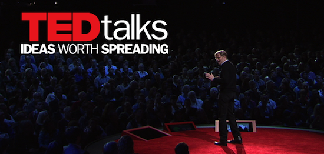

#  Capstone Project: Ted Talk View Count Prediction

## Problem Statement

In this project, we analyse the [Ted Talk dataset](urlhttps://www.kaggle.com/thegupta/ted-talk) obtained through webscraping the TED homepage, to determine what features affects the view count of TED talks. Through the development of selected best model - logistic classification model, the view count of TED talks will be predicted using various features (variables) of TED talks from the [Ted Talk dataset](urlhttps://www.kaggle.com/thegupta/ted-talk).

This is a binary classification problem which predicts whether a TED talk is popular and unpopular based on its features.

**Questions that we need to answer:**
- Which features makes a TED talk popular?
- Based on the features, can we tell a TED talk video is popular or unpopular?

**Types of models that will be developed:**
- Logistic Regression with or without Tfidf and cvec
- Multinomial Naive Bayes with Tfidf and cvec
- Random Forest Classifier
- KNeighborsClassifier
- Support Vector Classifier

I am a data scientist working in TED organization. My aim of this project is provide a useful prediction model for our primary stakeholder, TED organization fundraising and marketing department. TED organization is a non profit corporation, to foster the spread of great ideas and spark conversation. Through conference attendance fees, sponsorships, foundation support, licensing fees and book sales, TED raise funds for video editing, web development and hosting for TED Talks, supporting extraordinary new voices as they develop their careers in science, the arts, social justice and of course, The Audacious Project. The Audacious Project is a collaborative funding initiative between TED and non-profits that convenes funders and social entrepreneurs in order to scale solutions to the world's most urgent challenges.

TED fundrising department can make use of my model to determine whether a particular talk is popular or unpopular, thereby adjust their fundrising strategy. Also, by knowing factors that will affect/increase view count, TED can invite/advise the speakers accordingly.

Secondary stakholders will be TED speakers to predict view count for their existing or upcoming TED videos, providing useful insights on the effect of different features on view count through our model. TED speakers can adjust their their talk according to what is popular, to increase the outreach of their ideas.

Success of the model will be evaluated based on classification accuracy. Best model will have the least difference in classification accuracy between the training and test dataset. This is to ensure no overfitting and model can still perform upon applying to unseen data. The model is then further interpreted using confusion matrix parameters.

## Executive summary

The project evaluates what features make a TED talk popular. The top features identified during initial exploratory data analysis showed that comment count, month year has strong correlation to view count. Whereas sentiments and content of transcripts has weak correlation to view count. These findings helped me built my best predictive model (Logistic Regression classifier) to classify a TED talk as popular or unpopular. Accuracy score to be 75%, 0% overfit, with the following parameters:
- C=1
- penalty = l2
- random state = 42

The model demostrates moderately good accuarcy of popularity prediction and has 0% overfit. From there, I found out which are the top predictive features of a popular TED talk. They are:
- comment count
- video age
- number of download languages
- duration
- leadership tag
- happiness tag
- whether it is a ted original video (animated)
- Number of subtitled videos

In a nutshell, characteristics of a popular TED talk is highly commented, published recently, 8 to 16 min long, high number of download languages, non-animated videos, low in number of subtitle language, likely to be about leadership, happiness and success. 

Paired with the domain knowledge of how these features associate with view count, myself, a Data Scientists in TED can now make use of the model, to recommend primary stakeholders from TED fundraising/marketing department and TED speakers to make adjustment to their talks accordingly. This production model can serve as a recommendation so that great ideas can reach out to more people and more funds can be raised to support solutions that are challenging to accomplish. It is therefore a good solution for TED fundraising department and speakers. 

We evaluate the success by choosing a model with the lowest difference in classification accuracy between test and training dataset. By interpreting the confusion metric, we can tell how the features predicts whether a TED talk is popular or unpopular.

On a sidenote, view count based on transcripts and sentiments are less promising. Modeling results and EDA shows that unpopular and popular TED talks have very similar sentiments, which are opinionated and positive. Transcript wise, best model is Naive Bayes + Tfidf achieved 63.1% score on unseen data. This result is not promising because based on EDA and modeling, important words used for popular and unpopular words are similar. They are 'one', 'knowledge', 'think', 'people'. This can be observed from the model coefficients generated, they were all negative. Meaning, no words can predict a unpopular TED talk. The sentiments and transcripts modeling result is however, understandable. Popular and unpopular TED talks all aligned with TED's vision, which is foster the spread of great ideas. It aims to provide a platform for thinkers, visionaries and teachers, so that people around the globe can gain a better understanding of the biggest issues faced by the world, and feed a desire to help create a better future. 

Areas for primary stakeholders (TED organisation fundraising and marketing department):
- Publish less animated videos and focus in more physical human presentations
- Invite more leaders for light hearted talks.
- Increase the number of embedded subtitles as subtitles are usually stored on a separate file.
- Decrease the number of subtitled videos as most non native englishing public prefers to download the video and watch offline (see previous point).

Areas for secondary stakeholders (TED speakers):
- TED speakers can consider my model and make adjustment to their presentation style.

Areas for data scientist's future expansion and future exploration:
- Expand recommender to that applies Collaborative filtering, which is find users who are similar and recommend what they like (user-based). Currently this method is not used by TED, hence great value for exploration.
- Increase the description or attributions from the items the user has interacted to recommend similar items. Examples, year published, speaker, duration, rather than just title alone.
- Evaluate recommender statistically
- Explore depolyment of recommender
- Moving forward, the model can be continuously improved by introducing more new data to it. Currently there is only 4000~ ted talk features. This can be increased as more TED talks were published.
- Other features eg comment content, number of words in the transcripts, speed of the speakers, gender of the speakers to be included into the dataset.
- Since TED is about supporting world's challenging issues, we can expand the model to predict the view count of challenging or less challenging issues.
- Since one of the feature is comment count, we can analyze deeper to see what are the factors that will trigger more comments and discussion of the public. When number comments increases, more people will go and view the video.
- Therefore, data scientist in TED organisation can consider predicting view count using viewer profiles information collected.

## Contents
[1_Ted Talk View Count Prediction using Features](code/1_features_viewcount_prediction.ipynb)\
[2_Ted Talk View Count Prediction using Transcipts](code/2_transcript_viewcount_prediction.ipynb)

## Data Dictionary

| Feature                                           | Type    | Dataset      | Description                                                |
|---------------------------------------------------|---------|--------------|------------------------------------------------------------|
| talk__id                                          | int64   | TED_talk.csv | id of talk                                                 |
| talk__name                                        | object  | TED_talk.csv | The title of the talk                                      |
| talk__description                                 | object  | TED_talk.csv | A blurb of what the talk is about                          |
| view_count                                        | int64   | TED_talk.csv | The number of views on the talk                            |
| comment_count                                     | float64 | TED_talk.csv | The number of first level comments made on the talk        |
| duration                                          | int64   | TED_talk.csv | The duration of the talk in seconds                        |
| transcript                                        | object  | TED_talk.csv | transcript                                                 |
| video_type_name                                   | object  | TED_talk.csv | TED video type, year of video                              |
| event                                             | object  | TED_talk.csv | The TED/TEDx event where the talk took place               |
| number_of__speakers                               | int64   | TED_talk.csv | The number of speakers in the talk                         |
| speaker__id                                       | float64 | TED_talk.csv | id of speaker                                              |
| speaker__name                                     | object  | TED_talk.csv | name of speaker                                            |
| speaker__description                              | object  | TED_talk.csv | description of speaker                                     |
| speaker__who_he_is                                | object  | TED_talk.csv | describe speaker                                           |
| speaker__why_listen                               | object  | TED_talk.csv | why listen to this speaker                                 |
| speaker__what_others_say                          | object  | TED_talk.csv | what others say about this speaker                         |
| speaker__is_published                             | float64 | TED_talk.csv | whether the speaker is published                           |
| all_speakers_details                              | object  | TED_talk.csv | speakers details                                           |
| is_talk_featured                                  | bool    | TED_talk.csv | whether the speaker is featured                            |
| has_talk_citation                                 | float64 | TED_talk.csv | whether the talk is cited                                  |
| recording_date                                    | object  | TED_talk.csv | date of recording                                          |
| published_timestamp                               | object  | TED_talk.csv | Date for the publication of the talk on TED.com            |
| talks__tags                                       | object  | TED_talk.csv | themes associated with the talk                            |
| number_of__tags                                   | int64   | TED_talk.csv | number of themes                                           |
| language                                          | object  | TED_talk.csv | language of language                                       |
| native_language                                   | object  | TED_talk.csv | language of native                                         |
| language_swap                                     | bool    | TED_talk.csv | swap of language                                           |
| is_subtitle_required                              | bool    | TED_talk.csv | subtitle_required                                          |
| url__webpage                                      | object  | TED_talk.csv | webpage of url                                             |
| url__audio                                        | object  | TED_talk.csv | audio of url                                               |
| url__video                                        | object  | TED_talk.csv | video of url                                               |
| url__photo__talk                                  | object  | TED_talk.csv | talk                                                       |
| url__photo__speaker                               | object  | TED_talk.csv | speaker                                                    |
| url__subtitled_videos                             | object  | TED_talk.csv | website of subtitled videos                                |
| number_of__subtitled_videos                       | int64   | TED_talk.csv | subtitled videos                                           |
| talk__download_languages                          | object  | TED_talk.csv | download languages                                         |
| number_of__talk__download_languages               | int64   | TED_talk.csv | number of download languages                               |
| talk__more_resources                              | object  | TED_talk.csv | more_resources                                             |
| number_of__talk__more_resources                   | int64   | TED_talk.csv | number of more resources                                   |
| talk__recommendations__blurb                      | object  | TED_talk.csv | blurb                                                      |
| talk__recommendations                             | object  | TED_talk.csv | recommendations of talk                                    |
| number_of__talk__recommendations                  | int64   | TED_talk.csv | recommendations                                            |
| related_talks                                     | object  | TED_talk.csv |  A list of dictionaries of recommended talks to watch next |
| number_of__related_talks                          | int64   | TED_talk.csv | related talks                                              |
| intro_duration                                    | float64 | TED_talk.csv | duration of intro                                          |
| ad_duration                                       | float64 | TED_talk.csv | duration of ad                                             |
| post_ad_duration                                  | float64 | TED_talk.csv | ad_duration                                                |
| external__duration                                | float64 | TED_talk.csv | duration of external                                       |
| external__start_time                              | float64 | TED_talk.csv | start_time                                                 |
| talks__player_talks__resources__h264__00__bitrate | float64 | TED_talk.csv | talks player talks resources bitrate                       |
| talks__take_action                                | object  | TED_talk.csv | talks that take action                                     |
| number_of__talks__take_actions                    | int64   | TED_talk.csv | number of actions taken                                    |

## Conclusion

**Viable classification model**
After evaluating all the models, the final optimized model is the Logistic Regression classifier with accuracy score to be 0.74, 0% overfit, with the following parameters:
- C=1
- penalty = l2
- random state = 42

I used the best performing model logistic regression to predict if a TED talk is popular or unpopular. The model demostrates moderately good accuarcy of popularity prediction and has 0% overfit. From there, I found out which are the top predictive features of a popular TED talk. They are:
- comment count
- video age
- number of download languages
- duration
- leadership tag
- happiness tag
- whether it is a ted original video (animated)
- Number of subtitled videos

Majority of the features above are aligned with my EDA results.

In a nutshell, characteristics of a popular TED talk is highly commented, published recently, 8 to 16 min long, high number of download languages, non-animated videos, low in number of subtitle language, likely to be about leadership, happiness and success. Primary stakeholders TED fundrising and marketing department and secondary stakeholders - TED speakers can now make use of my model to increase popularity of their talks, so that big ideas can outreach to more people. This can increases interest and more funds can be raised to support world's most challenging issues.

On a sidenote, view count based on transcripts and sentiments are less promising. Modeling results and EDA shows that unpopular and popular TED talks have very similar sentiments, which are opinionated and positive. Transcript wise, best model is Naive Bayes + Tfidf achieved 63.1% score on unseen data. This result is not promising because based on EDA and modeling, important words used for popular and unpopular words are similar. They are 'one', 'knowledge', 'think', 'people'. This can be observed from the model coefficients generated, they were all negative. Meaning, no words can predict a unpopular TED talk. The sentiments and transcripts modeling result is however, understandable. Popular and unpopular TED talks all aligned with TED's vision, which is foster the spread of great ideas. It aims to provide a platform for thinkers, visionaries and teachers, so that people around the globe can gain a better understanding of the biggest issues faced by the world, and feed a desire to help create a better future. 

**Project Achievement Summary**
- View count prediction using transcripts ~63% accuracy
- View count prediction using features ~75% accuracy with 0% overfit
- Sentiment Analysis. All talks are positive and opinionated. This aligned with TED vision
- Created a simple content based recommender Reasonable recommendations made by the model. Further improvement needed. Please see recommendations.

## Recommendations

Areas for primary stakeholders (TED organisation fundraising and marketing department):
- Publish less animated videos and focus in more physical human presentations
- Invite more leaders for light hearted talks.
- Increase the number of embedded subtitles as subtitles are usually stored on a separate file.
- Decrease the number of subtitled videos as most non native englishing public prefers to download the video and watch offline (see previous point).

Areas for secondary stakeholders (TED speakers):
- TED speakers can consider my model and make adjustment to their presentation style.

Areas for my future expansion and future exploration:
- Expand recommender to that applies Collaborative filtering, which is find users who are similar and recommend what they like (user-based). Currently this method is not used by TED, hence great value for exploration.
- Increase the description or attributions from the items the user has interacted to recommend similar items. Examples, year published, speaker, duration, rather than just title alone.
- Evaluate recommender statistically
- Explore depolyment of recommender
- Moving forward, the model can be continuously improved by introducing more new data to it. Currently there is only 4000~ ted talk features. This can be increased as more TED talks were published.
- Other features eg comment content, number of words in the transcripts, speed of the speakers, gender of the speakers to be included into the dataset.
- Since TED is about supporting world's challenging issues, we can expand the model to predict the view count of challenging or less challenging issues.
- Since one of the feature is comment count, we can analyze deeper to see what are the factors that will trigger more comments and discussion of the public. When number comments increases, more people will go and view the video.
- Therefore, data scientist in TED organisation can consider predicting view count using viewer profiles information collected.

## Future Steps
Now that we have proven the viability of classifying prediction model, the next step will be for TED fundrising and marketing department to implement the features for their upcoming talks. Example, made the characteristics of a popular TED talk known to the future speakers as recommendations or make less of animated videos and focus in physical human talks.

## Limitations
- Our model has an accuarcy 0.74 hence there will be risk of falsely prediction. The implementation plan can still be adjusted accordingly. Speaker and TED organisation will have the right to decide the nature and features of talk that suits them most.
- This modeling process only works for binary classification. For Multi classification problems, the process will have to be modified and reevaluated.
- Transcripts and sentiments have limitation for predictions, reason being all the talks, be it popular or unpopular are aligned with the vision of TED organization. 